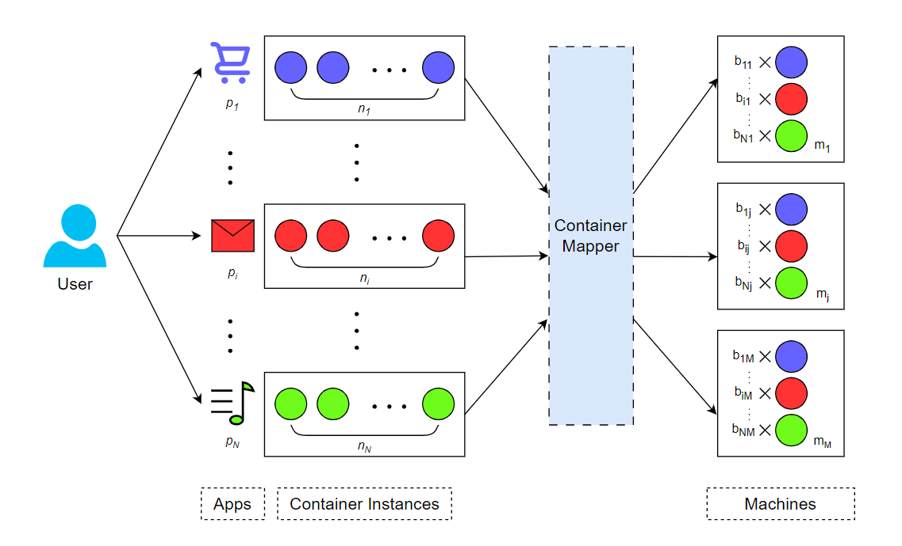

# Power Aware Container Scheduling in Cloud Computing with Affinity and Cubic Power Model
## Submitted By: Nandini Sharma (200101122) and Akshat Mittal (200101011)

- Containers are the preferred choice for running internet applications on data centers. If a container is assigned to the anti-affinity machine, it may hamper performance and proper operation of container due to incompatible machine. Whereas assigning container to its affinity machine can reduce costs due to communication and transportation.
- In order to reduce the maintenance and operation cost of data centers, this work focuses on the problem of allocating containers on heterogeneous server clusters. The purpose is to meet the affinity/anti-affinity requirements as much as possible while minimizing power consumption of the cluster.
- We model the number of containers of a particular application to be run on a server as an Integer Non-Linear Programming problem having a cubic optimization function and linear constraints.
- We propose a heuristic which always selects the machine giving least cost increment out of a machine with least utilization and a machine with best affinity to the container to be scheduled. We examine the performance of proposed heuristic under varying loads and constraints.
- Finally, the results demonstrate that our heuristic improves affinity satisfaction ratio by upto 4\% while decreasing upto 26\% of total system cost as compared to state-of-the-art approaches. Thus, managing to improve affinity payoff ratio by upto 37\%.



### Python Libraries Used
- Numpy
- Matplotlib
- Pandas
- Mosek
- Make sure to install the above libraries before running the code using following command:
```bash
pip install numpy matplotlib mosek pandas
```

### How to run an IPYNB file
- Inside Jupyter Notebook, you can run each cell of the IPYNB file by clicking on it and pressing `Shift + Enter` or by using the `Run` button in the toolbar.
- Alternatively, you can run the whole notebook in a single go by using the `Run All` option in the toolbar.